# Autonomous PM – Project Overview

**Autonomous PM** is an AI-native project management platform. Work comes in from Slack, GitHub and a web
dashboard, and a team of small AI agents takes care of the routine project-manager jobs:

- triaging and prioritising tickets
- spotting duplicate reports
- breaking big tickets into sub-tasks
- writing the daily standup
- keeping ticket status in sync with GitHub
- handing a ticket to a coding agent (Claude Code, Codex or Cursor) with all the context it needs

Every change is recorded on the ticket's timeline with who made it and why, so the AI's decisions stay
explainable.

---

## Architecture at a glance

The platform is a set of small services. The **Ticket Service** is the single source of truth; every other
service reads from it or writes to it.

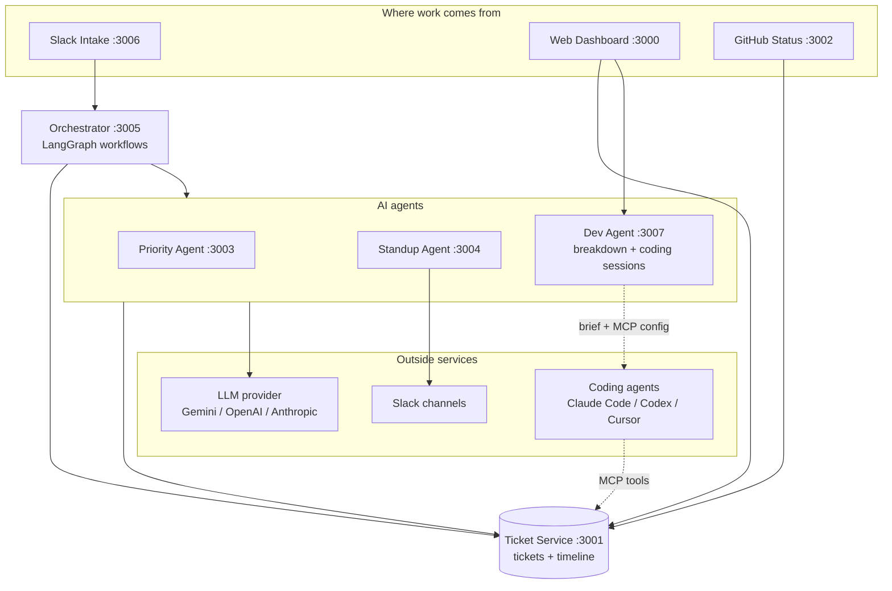

| Service | Port | Tech | Role |
|---|---|---|---|
| Web Dashboard | 3000 | Next.js 14, Tailwind | The team's view of all work |
| Ticket Service | 3001 | Python, FastAPI, SQL/MongoDB | Tickets, timeline, links, similarity |
| GitHub Status | 3002 | Node.js, Express | Turns GitHub events into status changes |
| Priority Agent | 3003 | Python, FastAPI, LLM | Scores and prioritises open tickets |
| Standup Agent | 3004 | Python, FastAPI, LLM | Writes and posts the daily standup |
| Orchestrator | 3005 | Python, FastAPI, LangGraph | Chains the agents into workflows |
| Slack Intake | 3006 | Node.js, Slack Bolt | Creates tickets from Slack |
| Dev Agent | 3007 | Python, FastAPI, git | AI breakdown and coding-agent hand-off |

---

## Features

### 1. Ticket management (Ticket Service)

The central store for all work. Every ticket has an ID like `APM-12`, a type (bug, feature, task,
incident, …), a status, a priority, an AI priority score, an assignee and its source (Slack, dashboard,
GitHub, API). Tickets can be linked: a ticket can be a **sub-task** of another, or marked as a **duplicate** of
another. A REST API serves the dashboard, the agents and the integrations.

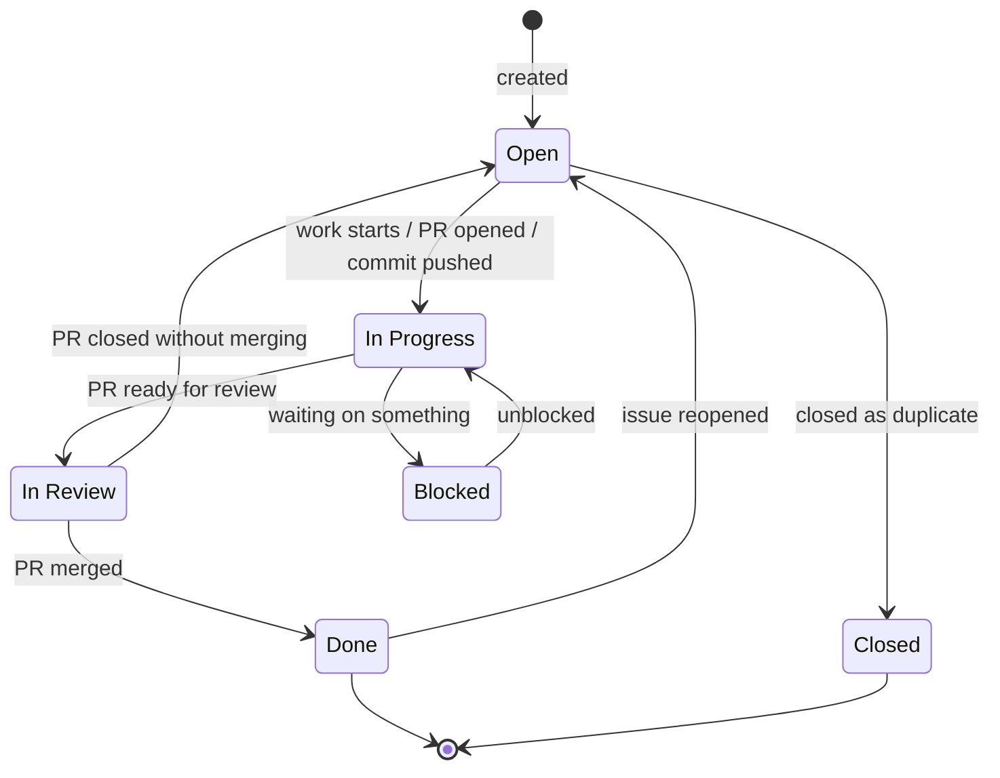

### 2. Web dashboard

A calm, professional workspace with warm pastel colours, light and dark mode, and keyboard shortcuts
(`/` to search, `n` for a new ticket).

- An overview of total, active, completed and blocked work, with a status-distribution bar.
- List and board (kanban) views with filters and search.
- A ticket side panel with three tabs: **Overview**, **Activity** and **Coding agent**.
- An Agent settings dialog for linking the codebase.

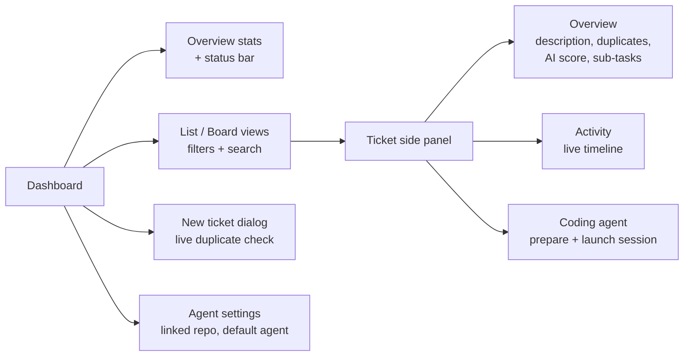

### 3. Slack intake

People report work where they already talk. A message in a watched channel containing a trigger word
("bug", "broken", "error", "outage", …), or the `/ticket <description>` slash command, creates a ticket.

The message goes through the orchestrator, which:

1. creates the ticket
2. checks it for duplicates
3. prioritises it
4. prepares a coding-agent session, if that's turned on

The bot then replies in the thread with the ticket ID, the AI priority and its reasoning, any likely
duplicates, and the session's branch. If the orchestrator can't be reached, the ticket is still created
directly.

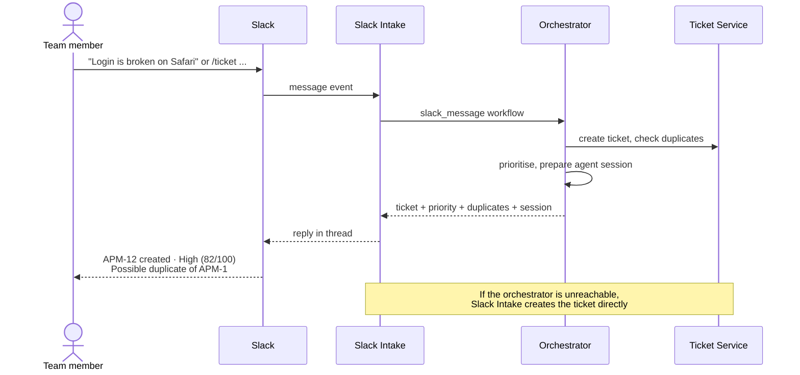

### 4. GitHub status sync

Developers never update tickets by hand. When a commit message, PR title or branch name mentions a ticket
(`APM-12`, `[TICKET:APM-12]`, `fixes #42`), GitHub's webhook moves the ticket automatically and posts an
update to Slack. The reason ("PR #31 merged: …") is recorded on the ticket's timeline.

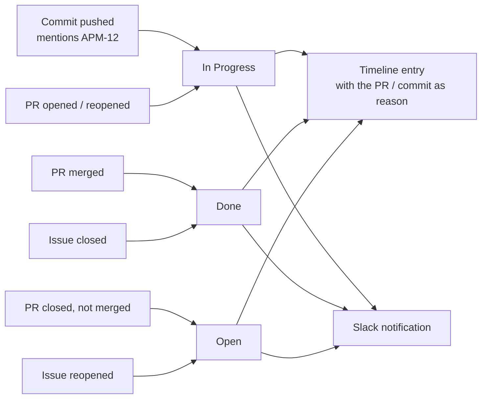

### 5. AI prioritisation

The Priority Agent reads every open ticket and asks the LLM to rank them. It weighs production impact,
how many users are affected, security, deadlines and dependencies. Each ticket gets a priority (Low → Critical),
a score from 1 to 100 and a short reason. It runs automatically every hour (configurable), for every new Slack
ticket, and on demand. The reasoning appears on the ticket's timeline.

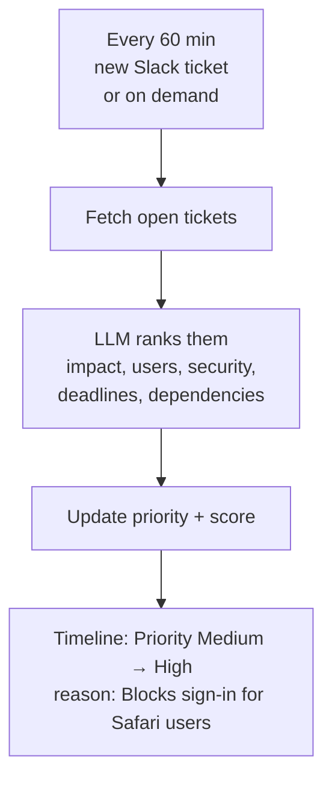

### 6. AI daily standup

Every weekday morning (09:00 by default, with a configurable schedule and timezone), the Standup Agent reads
the active tickets and groups them by person. The LLM then writes a short team summary and a one-line update
for each person. The standup is posted to the Slack standup channel, and it can also be generated on demand.

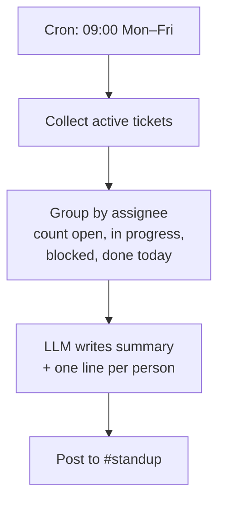

### 7. Orchestrator workflows

The orchestrator chains the agents into workflows using LangGraph. A step that fails (for example, the LLM is
unavailable) is reported, and the rest of the workflow still runs.

| Workflow | Steps |
|---|---|
| `slack_message` | create ticket → check duplicates → prioritise → prepare agent session |
| `full_pipeline` | the same steps, then generate the standup |
| `manual_standup` | generate the standup |
| `github_event` | record a GitHub event |

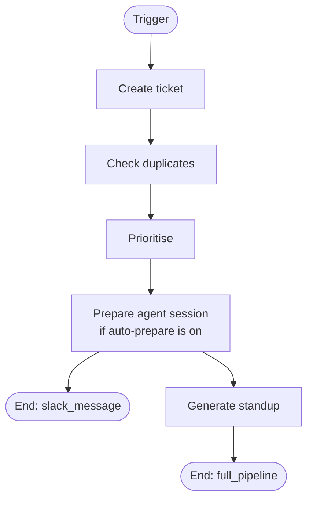

### 8. Duplicate detection

The same problem often gets reported twice. Every ticket is compared with all the others by meaning-bearing
words, using TF-IDF with cosine similarity. This needs no API key and gives the same result every time.

- **While typing:** the New-ticket dialog shows "Similar tickets already exist", with match percentages.
- **On creation:** likely duplicates are recorded on the new ticket's timeline.
- **In the ticket panel:** a "This may be a duplicate" notice with a one-click **Mark duplicate**, which links
  the ticket and closes it.
- **In Slack:** the bot's reply lists likely duplicates.

Sub-tasks are never flagged as duplicates of their own parent.

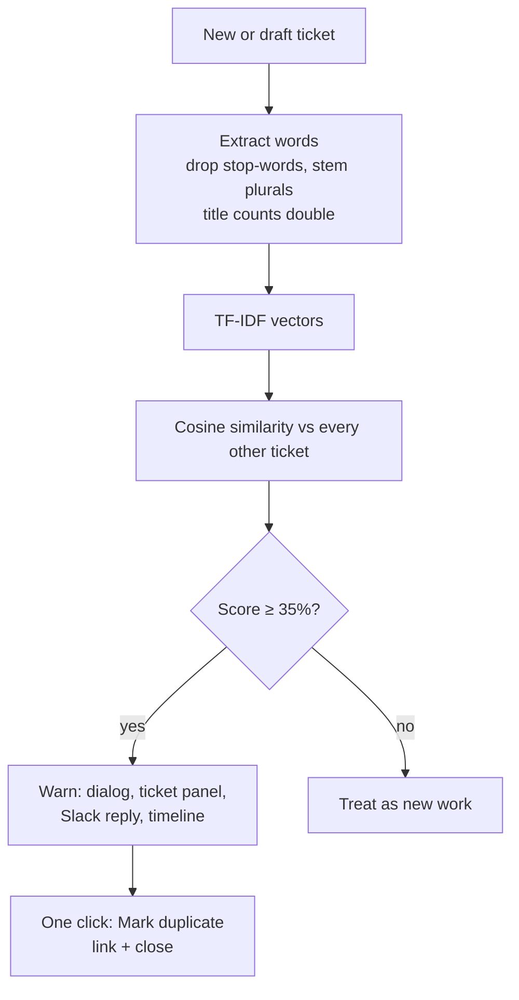

### 9. AI breakdown into sub-tasks

Big or vague tickets are hard to start. **Break down with AI** asks the LLM to split a ticket into 3–8
sub-tasks, each small enough for one person and one pull request. Each comes with a type, an estimate in
hours and its dependencies. The result is a **proposal**: you tick the ones you want, and only those are
created as linked sub-tasks. A progress bar on the parent shows how many are done. You can also add sub-tasks
by hand.

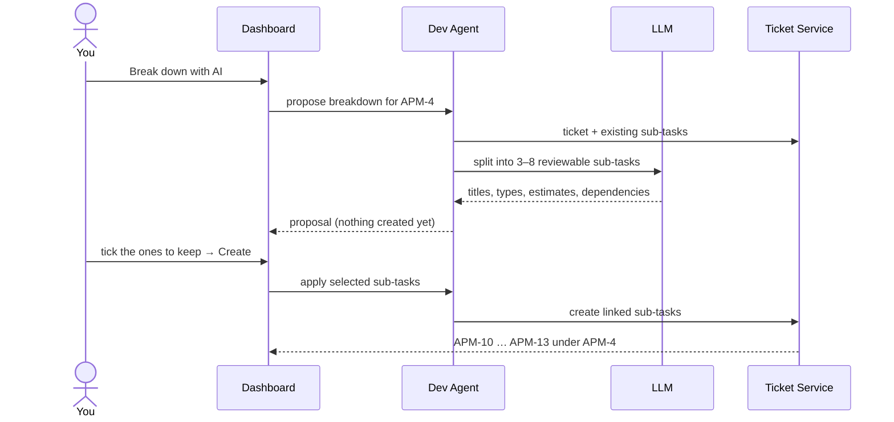

### 10. Explainable activity timeline

Every ticket has a timeline of everything that happened to it: who did it and **why**. That includes:

- creation, status, priority and assignee changes
- links (sub-task, duplicate) and possible-duplicate warnings
- sub-tasks being created
- coding-agent sessions being prepared
- progress notes from coding agents

AI decisions carry their reasoning, PR-driven changes carry the PR, and repeated small re-scores are left out so
the history stays readable. The Activity tab refreshes live while it's open.

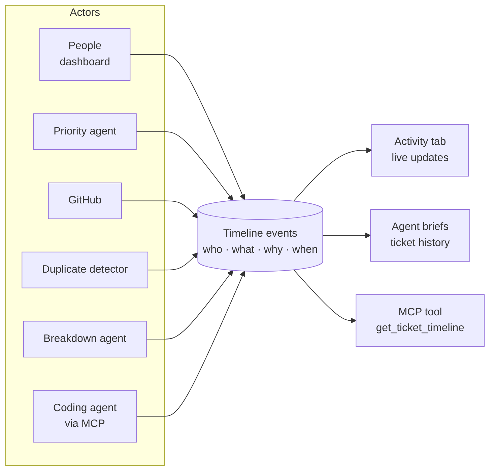

### 11. Coding-agent hand-off (manual mode)

The standout feature. One click on **Coding agent → Prepare agent session** turns a ticket into a ready-to-start
session for **Claude Code, Codex or Cursor**:

1. **A workspace of its own:** a git worktree on a new branch `apm/APM-12-<title>`, so your main checkout is
   never touched.
2. **A context brief** (`.apm/APM-12.md`) containing:
   - the ticket, the AI priority reasoning and its history
   - related tickets, sub-tasks and earlier commits
   - **the most relevant files in the codebase**, ranked by how strongly they match the ticket, with short code excerpts
   - the repo's own rules (`CLAUDE.md`, `AGENTS.md`, `.cursor/rules`) and how to run its tests
   - AI-drafted acceptance criteria and a suggested plan
3. **A one-line command** to start the chosen agent. For Cursor there is also a link that sends the prompt
   straight to its chat.

It's **manual mode**: the agent reads the brief, summarises the ticket, proposes a plan and **waits for the
developer's go-ahead** before changing code. Sessions can also be prepared automatically for every new ticket
(*auto-prepare*), so the context is ready when someone picks the ticket up.

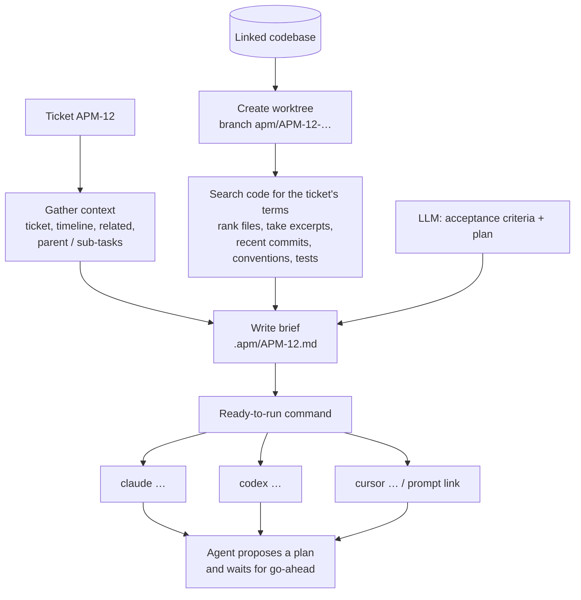

### 12. Ticket tools inside the coding agent (MCP server)

The coding agent stays connected to the board while it works. A bundled **Model Context Protocol** server
(`autonomous-pm`) is wired into each session automatically:

- Claude Code gets it through `--mcp-config`.
- Cursor gets it through `.cursor/mcp.json`.
- Codex gets it from a config snippet shown in the dashboard.

It gives the agent seven tools:

| Tool | What it does |
|---|---|
| `get_ticket` | Full ticket details |
| `get_ticket_timeline` | History, including the AI's reasoning |
| `find_similar_tickets` | Related tickets that may hold earlier fixes |
| `list_subtasks` | Sub-tasks and their status |
| `search_tickets` | Search the board |
| `add_progress_note` | Log progress on the ticket's timeline |
| `update_ticket_status` | Move to In Progress, In Review or Blocked |

Agents can't mark work **Done**; that happens when the pull request is merged.

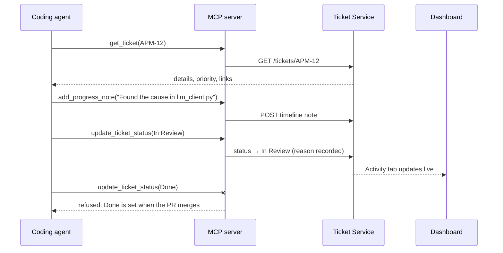

---

## End-to-end user flow

From a message in Slack to merged code, with people deciding at each key step:

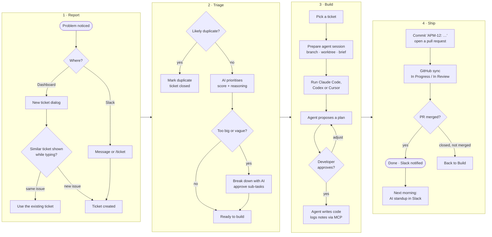

Every step along the way – AI decisions, GitHub events, agent notes and people's edits – is recorded on the
ticket's timeline with who did it and why.
