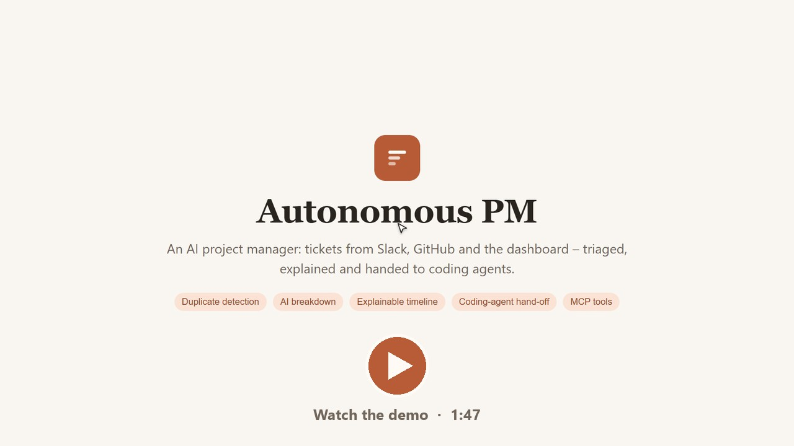
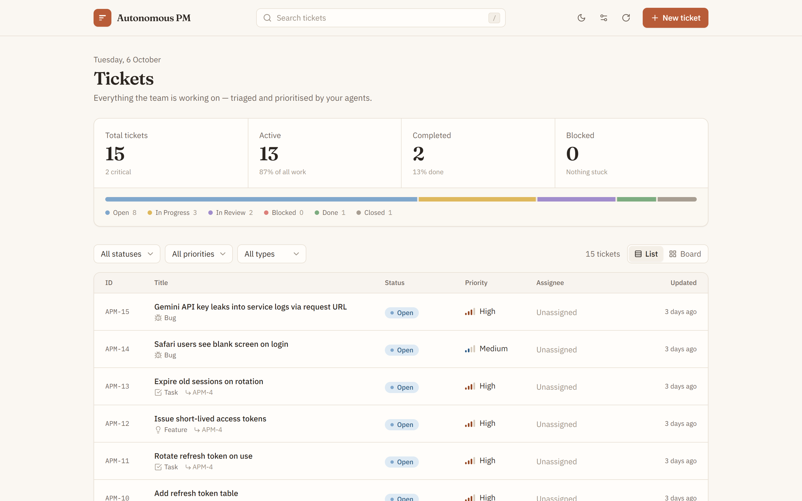
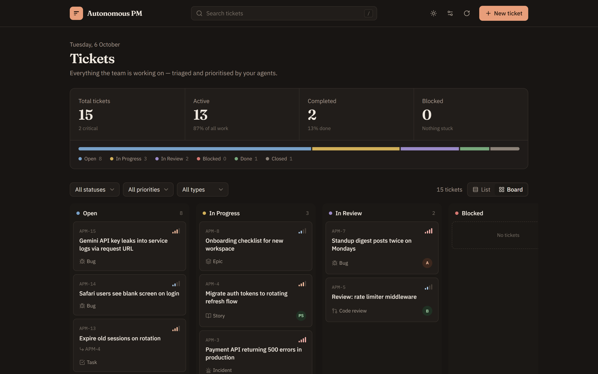
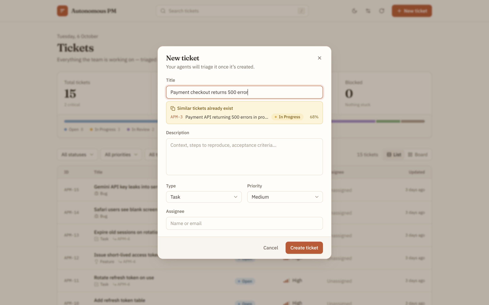
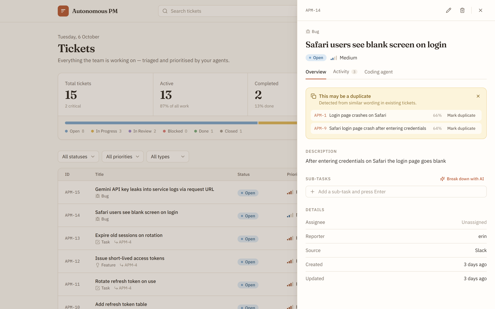
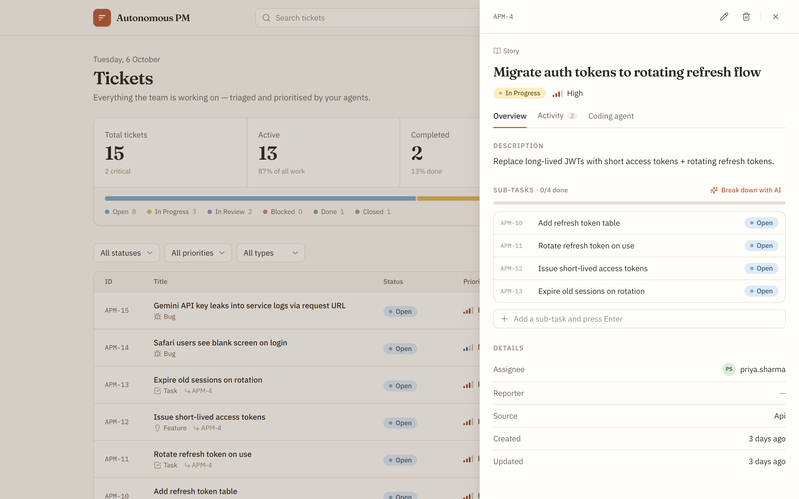
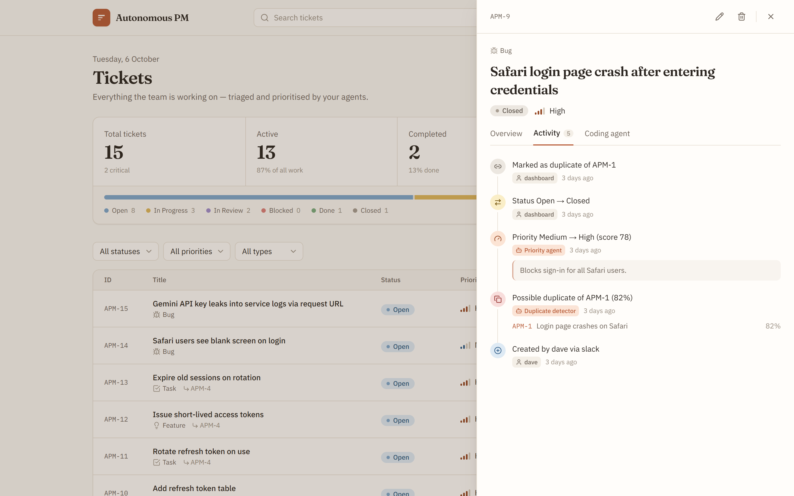
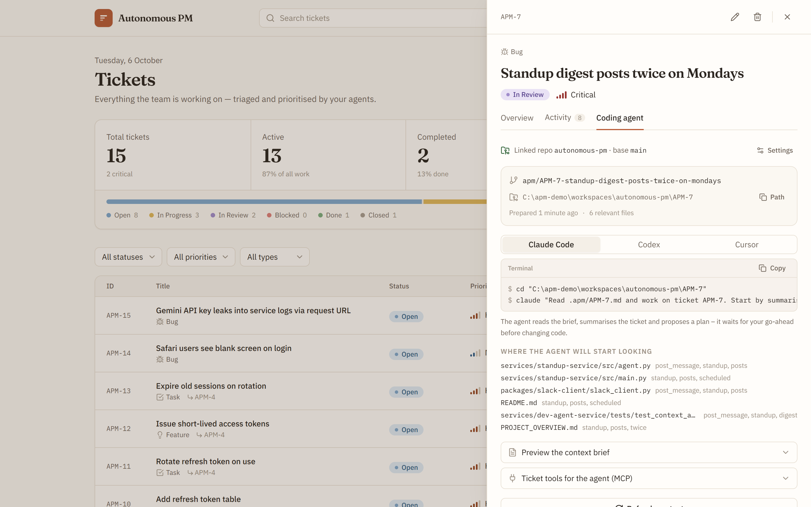
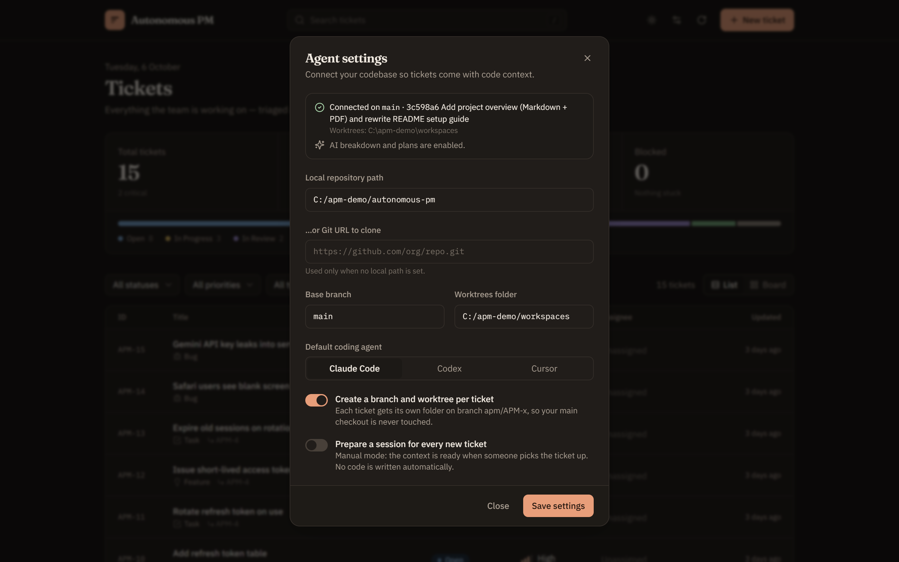
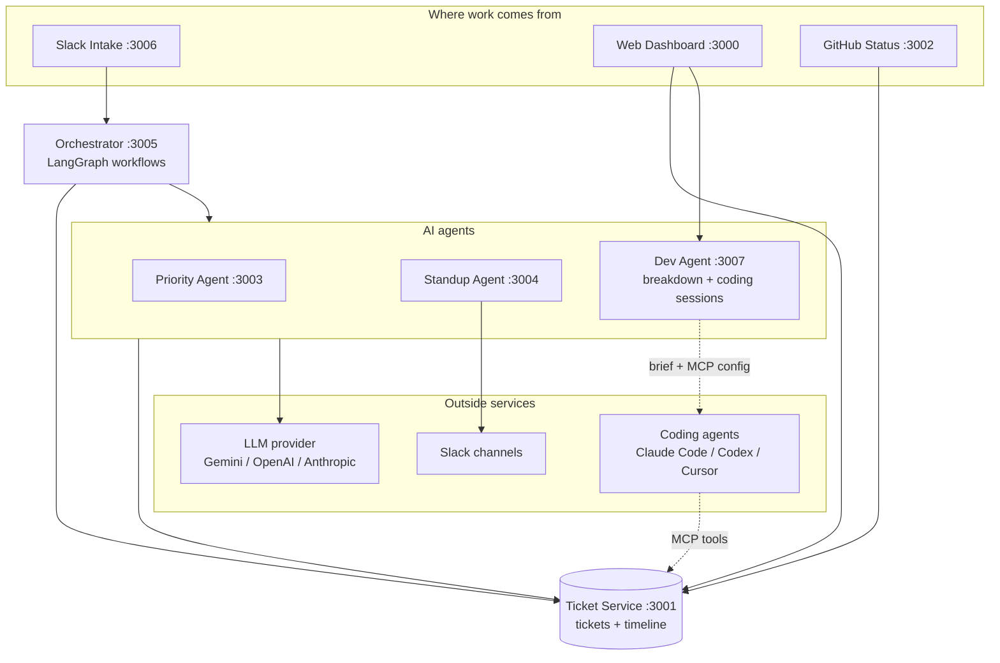

# Autonomous PM

An AI-native project management platform. Work comes in from Slack, GitHub and a web dashboard, and a team of
small AI agents handles the routine project-manager jobs: triage and prioritisation, duplicate detection,
breaking work down, daily standups, GitHub status sync – and handing tickets to coding agents with full context.

📄 **[Project overview with diagrams (PDF)](PROJECT_OVERVIEW.pdf)** · [Markdown version](PROJECT_OVERVIEW.md)

## Demo

[](https://drive.google.com/file/d/1n1SGomRxTWfjDXmavXsadAd7eT2uYY6m/view?usp=sharing)

A 1:47 walkthrough recorded from the app running locally: live duplicate detection while creating a ticket,
sub-tasks, the explainable activity timeline, the coding-agent hand-off – and a coding agent reporting back
through the MCP server while the dashboard updates live. ([Open the video](https://drive.google.com/file/d/1n1SGomRxTWfjDXmavXsadAd7eT2uYY6m/view?usp=sharing))

## Features

- **Ticket board** – web dashboard with list and board views, filters, search, and light/dark mode.
- **Slack intake** – create tickets from a message or `/ticket`; the bot replies with the AI priority and likely duplicates.
- **GitHub sync** – commits and PRs that mention `APM-12` move the ticket automatically (In Progress → Done).
- **AI prioritisation** – an agent scores open tickets (1–100) with a written reason, hourly and on demand.
- **AI daily standup** – a per-person summary of active work, posted to Slack every weekday morning.
- **Duplicate detection** – every new ticket is compared with existing ones; warnings appear while you type,
  in the ticket panel and in Slack, and one click closes a ticket as a duplicate.
- **AI breakdown** – split a big ticket into 3–8 reviewable sub-tasks with estimates and dependencies; you
  approve which ones are created.
- **Explainable timeline** – every change is recorded with who made it and *why*: the priority agent's
  reasoning, the PR that moved a ticket, notes from coding agents.
- **Coding-agent hand-off (manual mode)** – one click prepares a session for **Claude Code, Codex or Cursor**:
  a dedicated git branch + worktree, a context brief with the most relevant code, related tickets, conventions
  and test commands, and a ready-to-run command. The agent proposes a plan and waits for the developer before
  changing code.
- **Ticket tools inside the agent (MCP)** – the coding agent can read the ticket, log progress notes and move
  it to *In Review* through the bundled `autonomous-pm` MCP server.

## Screenshots

| Ticket board (light) | Board view (dark) |
|---|---|
|  |  |
| **Live duplicate check while typing** | **Duplicate warning in the ticket panel** |
|  |  |
| **Sub-tasks and AI breakdown** | **Explainable activity timeline** |
|  |  |
| **Coding-agent hand-off** | **Agent settings (dark)** |
|  |  |

## Architecture



## Services

| Service | Port | Language | Purpose |
|---------|------|----------|---------|
| `web-dashboard` | 3000 | Next.js 14 / TypeScript | UI |
| `ticket-service` | 3001 | Python / FastAPI | Tickets, timeline, links, duplicate detection, stats |
| `github-status-service` | 3002 | Node.js / Express | GitHub webhook receiver |
| `priority-service` | 3003 | Python / FastAPI | LLM ticket prioritisation (scheduled) |
| `standup-service` | 3004 | Python / FastAPI | LLM standup generator (scheduled) |
| `orchestrator-service` | 3005 | Python / FastAPI + LangGraph | Workflow coordinator |
| `slack-intake-service` | 3006 | Node.js / Slack Bolt | Slack event listener |
| `dev-agent-service` | 3007 | Python / FastAPI | AI breakdown, coding-agent sessions, ticket MCP server |

---

## Getting started

```bash
git clone https://github.com/letusnotc/autonomous-pm.git
cd autonomous-pm
cp .env.example .env
```

Edit `.env` and add **one** LLM key – `GEMINI_API_KEY` (default provider), or set `LLM_PROVIDER=openai` /
`anthropic` with the matching key. Everything except the AI features (prioritisation, standups, breakdown, AI
plans) works without a key. Slack and GitHub settings are optional.

Then choose **Docker** or a **local setup**.

### Option A – Docker

Requires Docker Desktop (or Docker Engine + the Compose plugin).

```bash
docker compose up -d --build
bash scripts/health-check.sh
```

This starts PostgreSQL and every service. Open the dashboard at **http://localhost:3000**.

- Logs: `docker compose logs -f <service>` · Stop: `docker compose down` (add `-v` to delete the database).
- `slack-intake-service` needs `SLACK_BOT_TOKEN` and `SLACK_SIGNING_SECRET`; without them it keeps restarting –
  everything else works. Stop it with `docker compose stop slack-intake-service`.
- To hand tickets to coding agents on your machine, run the **Dev Agent Service natively** (Option B) – inside a
  container, worktrees and briefs live at container paths your local Claude Code / Codex / Cursor can't open.

### Option B – Local setup (no Docker)

Requires **Python 3.11 or 3.12**, **Node.js 18+**, **git** and **bash** (on Windows use Git Bash). Runs on
macOS, Linux and Windows, and uses SQLite instead of PostgreSQL.

```bash
bash scripts/setup-local.sh     # one time: Python venv, all dependencies, Node packages, .env
bash run-local.sh               # start every service (logs in ./logs)
bash scripts/health-check.sh    # all services should report ✓ (Slack Intake only runs with Slack credentials)
bash run-local.sh stop          # stop everything
```

Open **http://localhost:3000** (the dashboard compiles for ~20 s on first load).

To use the coding-agent hand-off, open **⚙ Agent settings** in the dashboard and enter the local path of the
repository your tickets are about. Each ticket's **Coding agent** tab then prepares a branch, worktree, context
brief and a one-line command for Claude Code, Codex or Cursor.

### Useful URLs

| What | URL |
|---|---|
| Dashboard | http://localhost:3000 |
| Ticket Service API docs | http://localhost:3001/docs |
| Priority Service API docs | http://localhost:3003/docs |
| Standup Service API docs | http://localhost:3004/docs |
| Orchestrator API docs | http://localhost:3005/docs |
| Dev Agent Service API docs | http://localhost:3007/docs |

---

## Environment Variables

All set in `.env` (copied from `.env.example`). Never commit `.env` – it is git-ignored.

| Variable | Required | Description |
|---|---|---|
| `LLM_PROVIDER` | No | `gemini` (default in `.env.example`), `openai` or `anthropic` |
| `GEMINI_API_KEY` / `GEMINI_MODEL` | For AI features with Gemini | Google AI Studio key and model |
| `OPENAI_API_KEY` / `OPENAI_MODEL` | For AI features with OpenAI | OpenAI key and model |
| `ANTHROPIC_API_KEY` / `ANTHROPIC_MODEL` | For AI features with Anthropic | Anthropic key and model |
| `SLACK_BOT_TOKEN` | Optional | `xoxb-...` – enables Slack intake, standup posting and notifications |
| `SLACK_SIGNING_SECRET` | Optional | Required by the Slack intake service |
| `SLACK_STANDUP_CHANNEL` / `SLACK_NOTIFY_CHANNEL` | Optional | Where standups and GitHub updates are posted |
| `WATCHED_CHANNELS` | Optional | Comma-separated Slack channel IDs to watch (empty = all) |
| `GITHUB_WEBHOOK_SECRET` | Optional | For GitHub webhook signature verification |
| `PRIORITY_SCHEDULE_MINUTES` | No | Minutes between automatic prioritisation runs (default `60`, `0` = off) |
| `STANDUP_CRON` | No | Crontab for the automatic Slack standup (default `"0 9 * * 1-5"`, `off` = disabled) |
| `STANDUP_TIMEZONE` | No | Timezone for `STANDUP_CRON` (default `UTC`, e.g. `Asia/Kolkata`) |
| `DATABASE_BACKEND` / `MONGODB_URI` | No | Set `DATABASE_BACKEND=mongo` and `MONGODB_URI` to use MongoDB instead of SQL |

Each service also has its own `.env.example` listing the variables it reads when run on its own.

---

## Deployment on Render

Render supports Docker-based deployments. Deploy each service as a separate **Web Service** using its Docker image, or use the **Infrastructure as Code** approach.

### Deploy each service

1. Go to [render.com](https://render.com) and create a new Web Service
2. Connect your GitHub repository
3. For each service, set:
   - **Environment**: Docker
   - **Dockerfile Path**: `services/ticket-service/Dockerfile` (adjust per service)
   - **Docker Context**: `.` (root) for priority/standup (they need shared packages), otherwise the service directory

### Recommended Render deployment order

1. **PostgreSQL** — Add a Render PostgreSQL database. Copy the `DATABASE_URL` it gives you.
2. **ticket-service** — Deploy first. Set `DATABASE_URL` from step 1.
3. **priority-service** — Deploy. Set `TICKET_SERVICE_URL` to the ticket-service Render URL.
4. **standup-service** — Deploy. Set `TICKET_SERVICE_URL`.
5. **orchestrator-service** — Deploy. Set all three service URLs.
6. **github-status-service** — Deploy. Set `TICKET_SERVICE_URL`.
7. **slack-intake-service** — Deploy. Set `TICKET_SERVICE_URL` + Slack credentials.
8. **dev-agent-service** — Deploy. Set `TICKET_SERVICE_URL` + an LLM key (Docker context: `.` root).
9. **web-dashboard** — Deploy last. Set `TICKET_SERVICE_URL` and `DEV_AGENT_SERVICE_URL`.

### Render environment variables per service

**ticket-service:**
```
DATABASE_URL         = (from Render PostgreSQL – use the "Internal Database URL")
PORT                 = 3001
SERVICE_BASE_URL     = https://your-ticket-service.onrender.com
CORS_ORIGINS         = https://your-dashboard.onrender.com
```

**priority-service:**
```
PORT                 = 3003
TICKET_SERVICE_URL   = https://your-ticket-service.onrender.com
LLM_PROVIDER         = openai
OPENAI_API_KEY       = sk-...
```

**standup-service:**
```
PORT                 = 3004
TICKET_SERVICE_URL   = https://your-ticket-service.onrender.com
LLM_PROVIDER         = openai
OPENAI_API_KEY       = sk-...
SLACK_BOT_TOKEN      = xoxb-...
SLACK_STANDUP_CHANNEL = #standup
```

**orchestrator-service:**
```
PORT                 = 3005
TICKET_SERVICE_URL   = https://your-ticket-service.onrender.com
PRIORITY_SERVICE_URL = https://your-priority-service.onrender.com
STANDUP_SERVICE_URL  = https://your-standup-service.onrender.com
```

**web-dashboard:**
```
PORT                 = 3000
TICKET_SERVICE_URL   = https://your-ticket-service.onrender.com
```

### render.yaml (optional – Infrastructure as Code)

Create this file to deploy all services at once:

```yaml
databases:
  - name: autonomous-pm-db
    databaseName: autonomous_pm
    user: apm_user

services:
  - type: web
    name: ticket-service
    env: docker
    dockerfilePath: services/ticket-service/Dockerfile
    dockerContext: services/ticket-service
    envVars:
      - key: DATABASE_URL
        fromDatabase:
          name: autonomous-pm-db
          property: connectionString
      - key: PORT
        value: 3001

  - type: web
    name: web-dashboard
    env: docker
    dockerfilePath: apps/web-dashboard/Dockerfile
    dockerContext: apps/web-dashboard
    envVars:
      - key: TICKET_SERVICE_URL
        fromService:
          name: ticket-service
          type: web
          property: host
```

---

## API Reference

### Ticket Service (port 3001)

All paths are canonical. No `/api/` prefix.

```
GET    /health
GET    /stats                         → DashboardStats
GET    /tickets                       → TicketListResponse
POST   /tickets                       → Ticket (201)
GET    /tickets/{id}                  → Ticket
PUT    /tickets/{id}                  → Ticket (PATCH semantics)
POST   /tickets/{id}/assign           → Ticket
DELETE /tickets/{id}                  → { deleted: true }

GET    /tickets?parent=APM-4          → sub-tasks of a ticket
GET    /tickets/{id}/events           → timeline (who changed what, and why)
POST   /tickets/{id}/events           → add a timeline entry (e.g. a progress note)
GET    /tickets/{id}/similar          → likely duplicates / related tickets
POST   /tickets/similar               → similar tickets for a draft { title, description }
POST   /tickets/{id}/subtasks         → create several sub-tasks at once
```

`PUT /tickets/{id}` also accepts `parent_id` / `duplicate_of` (`"APM-3"` to link, `""` to clear) and the
timeline metadata `actor` and `reason`, which are recorded on the ticket's timeline rather than stored on it.

Duplicate detection uses TF-IDF cosine similarity (no API key needed). New tickets scoring ≥ 0.35 against an
existing ticket get a *possible duplicate* timeline entry automatically.

**Canonical enum values** (use these exact strings):

| Field | Valid values |
|---|---|
| `status` | `Open`, `In Progress`, `In Review`, `Done`, `Closed`, `Blocked` |
| `priority` | `Low`, `Medium`, `High`, `Critical` |
| `ticket_type` | `bug`, `feature`, `task`, `incident`, `code_review`, `epic`, `story`, `spike` |

**Ticket ID format:** `APM-{integer}` (e.g. `APM-1`, `APM-42`)

### Orchestrator Service (port 3005)

```
POST /orchestrate/start
GET  /orchestrate/workflows
GET  /health
```

**Trigger kinds:**

| Trigger | Description | Required field |
|---|---|---|
| `slack_message` | Create ticket → check duplicates → prioritise → prepare agent session* | `slack_payload` |
| `github_event` | Record GitHub event | `github_payload` |
| `manual_standup` | Generate standup now | none |
| `full_pipeline` | `slack_message` steps + standup | `slack_payload` |

\* only when *auto-prepare* is enabled in the dashboard's Agent settings.

### Dev Agent Service (port 3007)

```
GET  /settings, PUT /settings          → linked repo, default agent, auto-prepare, worktrees
GET  /repo/status                      → linked repo health + whether an LLM key is configured
POST /tickets/{id}/breakdown           → AI-proposed sub-tasks (nothing created yet)
POST /tickets/{id}/breakdown/apply     → create the approved sub-tasks
POST /tickets/{id}/session             → prepare a coding-agent session { agent, include_ai_plan }
GET  /tickets/{id}/session             → the prepared session (commands, branch, worktree)
GET  /tickets/{id}/brief               → the Markdown context brief
POST /auto-prepare/{id}                → used by the orchestrator / dashboard for new tickets
```

**How a session is prepared (manual mode – no code is changed):**

1. Ticket details, timeline, parent/sub-tasks and similar tickets are collected.
2. A worktree is created at `<workspaces>/<repo>/APM-x` on a new branch `apm/APM-x-<slug>`; your main checkout is never touched.
3. The code is searched (`git grep`) for the ticket's keywords; files are ranked TF-IDF-style and the best ones get focused excerpts and their recent commits. Conventions (`CLAUDE.md`, `AGENTS.md`, `.cursor/rules`) and test commands are detected.
4. With an LLM key, acceptance criteria and a suggested plan are drafted.
5. `.apm/APM-x.md` (the brief) and MCP configs are written into the worktree and hidden via `.git/info/exclude`.
6. The dashboard shows a ready-to-run command per agent:

```bash
claude "Read .apm/APM-7.md and work on ticket APM-7. …" --mcp-config .apm/mcp.json   # Claude Code
codex  "Read .apm/APM-7.md and work on ticket APM-7. …"                              # Codex
cursor "<worktree>"   # then "Send the prompt to Cursor chat" (deep link) or use cursor-agent
```

**Ticket MCP server** (`services/dev-agent-service/mcp/ticket_mcp_server.py`, standard library only) gives the
agent these tools: `get_ticket`, `get_ticket_timeline`, `find_similar_tickets`, `list_subtasks`,
`search_tickets`, `add_progress_note`, `update_ticket_status` (In Progress / In Review / Blocked – *Done* is left
to the merged PR). Claude Code gets it via `--mcp-config`, Cursor via `.cursor/mcp.json` in the worktree, and
Codex via the TOML snippet shown in the dashboard.

> Run the Dev Agent Service natively (`run-local.sh`) when handing sessions to agents on your machine – inside
> Docker the worktree paths would be container paths.

### Priority Service (port 3003)

Runs automatically every `PRIORITY_SCHEDULE_MINUTES` (default 60) as well as on demand.

```
POST /tickets/prioritize    → PriorityReport
GET  /tickets/priorities    → PriorityReport (cached)
GET  /health
```

### Standup Service (port 3004)

Posts a standup to Slack automatically on `STANDUP_CRON` (default 09:00 Mon–Fri, `STANDUP_TIMEZONE`) as well as on demand.

```
POST /standup/generate      → StandupReport
GET  /standup/summary       → StandupReport (cached)
GET  /health
```

### GitHub Status Service (port 3002)

```
POST /github-webhook        → { received: true }
GET  /health
```

GitHub webhook events handled: `pull_request`, `push`, `issues`.
Ticket ID patterns detected: `APM-123`, `closes #42`, `[TICKET:APM-5]`

### Slack Intake Service (port 3006)

- **Bot events:** Detects trigger keywords in watched channels → creates tickets
- **Slash command:** `/ticket <description>` → creates ticket
- Both run the orchestrator's `slack_message` workflow (create → check duplicates → prioritise → prepare agent
  session) and reply with the AI priority and any likely duplicates. If the orchestrator is unreachable the
  ticket is created directly in the Ticket Service.
- **Slack Events URL:** `https://your-slack-service/slack/events`

---

## Slack App Setup

1. Create a new app at [api.slack.com/apps](https://api.slack.com/apps)
2. Add **Bot Token Scopes**: `chat:write`, `channels:history`, `app_mentions:read`, `commands`
3. Enable **Event Subscriptions** → URL: `https://your-slack-intake-service/slack/events`
4. Subscribe to bot events: `message.channels`
5. Add slash command `/ticket` → Request URL: `https://your-slack-intake-service/slack/events`
6. Install app to workspace → copy Bot Token (`xoxb-...`) and Signing Secret

---

## GitHub Webhook Setup

1. Go to your GitHub repo → Settings → Webhooks → Add webhook
2. **Payload URL:** `https://your-github-status-service/github-webhook`
3. **Content type:** `application/json`
4. **Secret:** matches `GITHUB_WEBHOOK_SECRET` env var
5. **Events:** Pull requests, Pushes, Issues

Reference tickets in commits/PRs as: `APM-42`, `closes #42`, or `[TICKET:APM-5]`

---

## Development

### Run a single service

```bash
# Python services (after scripts/setup-local.sh, using the shared .venv)
cd services/ticket-service
../../.venv/bin/python -m uvicorn src.main:app --reload --port 3001     # Windows: ../../.venv/Scripts/python

# Node services
cd services/github-status-service
npm run dev

# Frontend
cd apps/web-dashboard
npm run dev
```

The priority and standup services import the shared `packages/llm-client` and `packages/slack-client` – add both
folders to `PYTHONPATH` when running them on their own (`run-local.sh` does this for you).

### Tests

```bash
bash scripts/run-tests.sh
```

Runs the Ticket Service API tests (CRUD, timeline, links, duplicate detection, sub-tasks), the Dev Agent
Service tests (code-context ranking and worktrees on a temporary git repo, breakdown validation with a stubbed
LLM, launch commands, and the MCP server over stdio), the shared LLM client tests, and the Jest tests for the
Slack intake and GitHub ticket-ID extraction. No API keys or running services are needed.

### Database

- **Local setup:** SQLite file at `services/ticket-service/dev.db` (created automatically, git-ignored).
- **Docker:** PostgreSQL 16 in the `postgres` container (data in the `postgres_data` volume).
- **MongoDB:** set `DATABASE_BACKEND=mongo` and `MONGODB_URI` for the ticket service.

New columns are added to existing SQL databases automatically on startup.

---

## Project Structure

```
autonomous-pm/
├── README.md
├── PROJECT_OVERVIEW.md / .pdf    # Feature overview with diagrams
├── docs/screenshots/             # Dashboard screenshots used in this README
├── docs/demo/                    # Demo video thumbnail (the video is on Google Drive)
├── docker-compose.yml            # Full stack with Docker (PostgreSQL + all services)
├── run-local.sh                  # Full stack without Docker (SQLite)
├── .env.example                  # Environment variable template
│
├── packages/
│   ├── llm-client/               # Shared Python LLM client: Gemini, OpenAI, Anthropic
│   └── slack-client/             # Shared Python Slack chat.postMessage client
│
├── services/
│   ├── ticket-service/           # Python/FastAPI – tickets, timeline, similarity (+ tests)
│   ├── orchestrator-service/     # Python/FastAPI + LangGraph workflows
│   ├── priority-service/         # Python/FastAPI + LLM, scheduled prioritisation
│   ├── standup-service/          # Python/FastAPI + LLM, scheduled standups
│   ├── slack-intake-service/     # Node.js/Slack Bolt (+ Jest tests)
│   ├── github-status-service/    # Node.js/Express webhooks (+ Jest tests)
│   └── dev-agent-service/        # Python/FastAPI – breakdown, coding-agent sessions, MCP server (+ tests)
│
├── apps/
│   └── web-dashboard/            # Next.js 14 dashboard
│
├── infrastructure/
│   └── postgres/init.sql
│
└── scripts/
    ├── setup-local.sh            # One-time local setup
    ├── run-tests.sh              # All test suites
    ├── health-check.sh           # Check every service
    └── dev-setup.sh              # Docker-based first-time setup
```
